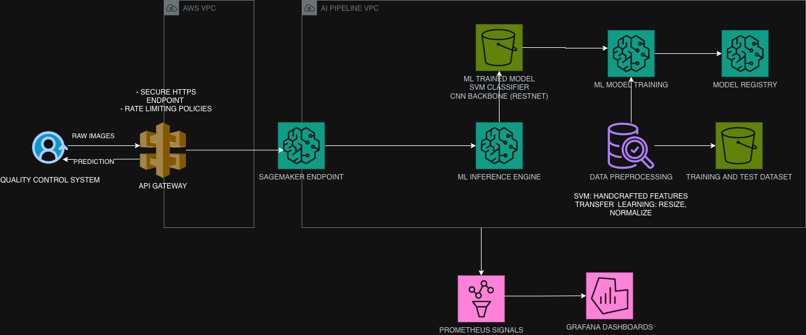

# Deployment Considerations

## 🏗️ Architecture

- The ML pipeline is deployed on **AWS SageMaker**.
- A **SageMaker Real-Time Endpoint** serves the model and accepts raw images as input.
- The inference service bundles **image preprocessing and model inference** in a single deployment artifact, ensuring consistency between training and production environments.
- **Amazon S3** is used to store:
  - Training and test datasets
  - Model artifacts
  - Supporting assets and metadata
- **SageMaker Model Registry** manages model versions, approval workflows, and deployment readiness.

---

## 📊 Observability

### Prometheus and Grafana

Prometheus and Grafana provide production-grade monitoring and visualization capabilities:

- Track inference latency, throughput, and resource utilization.
- Monitor prediction distributions and class-specific error metrics (e.g., false positives and false negatives).
- Log requests, predictions, and operational metrics for troubleshooting and quality assurance.
- Configure alerts for abnormal system behavior, performance degradation, and potential model drift.

---

## 🔒 Security

### AWS API Gateway

AWS API Gateway acts as the secure entry point to the ML inference service:

- Enforces HTTPS communication between clients and the ML pipeline.
- Applies rate-limiting and throttling policies to prevent abuse and maintain system stability.
- Validates and sanitizes incoming requests, including checks on image format, resolution, and payload size.
- Supports authentication and authorization mechanisms and can be integrated with additional security controls such as AWS WAF.

---

# ✅ Design Justification

### AWS API Gateway

AWS API Gateway is a fully managed service that provides secure API exposure, request validation, authentication, and rate limiting, helping protect the inference service while ensuring reliable access.

### Bundled Preprocessing and Inference

Combining preprocessing and inference into a single deployment ensures that the same transformations used during training are consistently applied during production inference, eliminating training-serving skew and improving prediction reliability.

### AWS SageMaker

AWS SageMaker provides a managed environment for model hosting, deployment, auto-scaling, and monitoring, reducing infrastructure management overhead and simplifying production operations.

### Amazon S3

Amazon S3 offers highly durable, scalable, and cost-effective storage for datasets, model artifacts, and deployment assets.

### SageMaker Model Registry

SageMaker Model Registry supports model lifecycle management through version control, approval workflows, traceability, and controlled promotion of models from development to production.

### Prometheus and Grafana

Prometheus and Grafana deliver flexible, enterprise-grade observability capabilities, enabling real-time monitoring of application performance, inference metrics, and model behavior through dashboards and alerting mechanisms.

---

# Diagram

# Note on Transfer Learning vs. Classical SVM

The proposed deployment architecture is compatible with both the classical **SVM-based approach** and the **transfer learning vision model (ResNet50)**. However, it is better suited to the transfer learning approach, as deep learning models benefit significantly from features provided by AWS SageMaker, including GPU-accelerated training, managed inference endpoints, model versioning, and scalable deployment.

For a classical SVM model, which is typically lightweight and CPU-based, the SageMaker hosting layer may introduce unnecessary cost and operational complexity. In such cases, a simpler architecture based on **Amazon ECS/Fargate with a FastAPI service** can provide a more cost-effective and streamlined solution while still supporting reliable model serving and monitoring.
